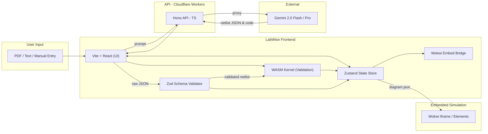
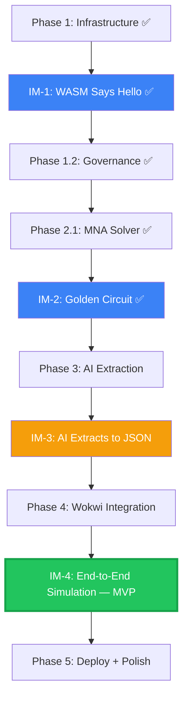

# LabWise — Master Implementation Plan

> **Philosophy:** *LabWise is the AI-powered Pre-Lab Environment.* AI extracts intent from messy lab manuals and constructs the circuit, while the Wokwi engine serves as the ultimate execution, embedded hardware emulation, and visualization environment. The Rust WASM kernel acts as a physics governance layer — validating circuits before they reach the simulator.

---

## Architecture Overview



**Data Flow:**

1. User uploads PDF or pastes text from their lab manual
2. Frontend sends cleaned text to Hono API (Cloudflare Workers)
3. Hono proxies the request to Gemini 2.0 Flash (protects API key)
4. AI returns extracted circuit JSON + microcontroller code
5. **Zod validates** the raw JSON structure (correct fields, types, enums)
6. **Rust Governance** performs physics validation (short circuits, over-voltage, pin conflicts)
7. Frontend `Wokwi Bridge` maps the validated Netlist into Wokwi's `diagram.json` format
8. The Wokwi simulator is embedded and initialized with the diagram and code
9. The student visualizes and interacts with the exact circuit they need to build in the lab

**Key Architectural Decisions:**
- No SharedArrayBuffer, no Web Workers. The WASM Kernel solves lab-scale circuits in <0.1ms — fast enough to call synchronously on every user action without blocking the UI.
- Wokwi handles ALL hardware emulation (Arduino code execution, sensor simulation, display rendering). We don't attempt to replicate this.
- The Rust kernel is retained as a fast pre-validation layer, not the primary simulator.

---

## Tech Stack

| Layer | Technology | Purpose |
| --- | --- | --- |
| **Frontend** | Vite + React + TypeScript | Application shell, AI chat interaction |
| **State** | Zustand | Global state (circuit, code, UI) |
| **Schema Validation** | Zod | Validate AI output structure (like Pydantic for TS) |
| **Simulation** | Wokwi Embed/Elements | 2D breadboard visualization, microcontroller emulation (Arduino, ESP32, Sensors) |
| **Validation** | Rust (`wasm-pack`) + `nalgebra` | Pre-simulation physics checks, MNA solver, structural governance |
| **Bridge** | WASM + `wasm-bindgen` | Rust-to-JS interop |
| **API** | Hono on Cloudflare Workers | Gemini API proxy, protect secrets |
| **AI** | Gemini 2.0 Flash (primary) / Pro (fallback) | Circuit & code extraction from lab manual text |
| **Deploy** | Cloudflare Pages + Workers | Free, no cold starts, 300+ edge locations |

---

## Directory Structure

```text
LabWise/
├── Cargo.toml                  # Cargo workspace root
├── kernel/                     # Rust validation engine
│   ├── Cargo.toml
│   └── src/
│       ├── lib.rs              # Entry point + public exports
│       ├── governance.rs       # GovernanceManager (shorts, conflicts, over-voltage)
│       ├── component_library.rs # Universal ComponentType enum
│       ├── mna.rs              # Modified Nodal Analysis solver
│       └── netlist.rs          # Netlist schema and parsing
├── bridge/                     # WASM interface crate
│   ├── Cargo.toml
│   └── src/
│       └── lib.rs              # wasm-bindgen exports (validate_circuit)
├── projection/                 # Frontend (Vite + React + TS)
│   ├── package.json
│   ├── vite.config.ts
│   ├── tsconfig.json
│   └── src/
│       ├── main.tsx
│       ├── App.tsx             # Main layout: input panel + Wokwi embed
│       ├── App.css             # Global styles (Inter font, dark theme)
│       ├── types.ts            # Core TS interfaces (Netlist, Pin, etc.)
│       ├── store/              # Zustand state management
│       │   ├── circuitStore.ts # Netlist, solution, failures, arduinoCode
│       │   ├── uiStore.ts     # Selection, panels, extraction mode
│       │   └── index.ts       # Barrel exports
│       ├── wokwi/              # Wokwi Integration Layer
│       │   ├── Mapper.ts       # Converts LabWise JSON → Wokwi diagram.json
│       │   └── WokwiEmbed.tsx  # React component wrapping the iframe
│       ├── synapse/            # AI extraction orchestration
│       │   ├── promptBuilder.ts    # System prompt + refinement prompt builder
│       │   ├── extractionPipeline.ts # Full extraction flow with retry logic
│       │   ├── schemas.ts          # Zod schemas for AI output validation
│       │   └── index.ts            # Barrel exports
│       ├── components/         # React UI components
│       │   ├── CircuitEditorPanel.tsx  # Review & Correct extracted circuits (P1)
│       │   └── ExtractionStatus.tsx   # Shows extraction progress and errors
│       ├── hooks/              # React hooks
│       └── wasm-pkg/           # Generated WASM output (gitignored)
├── api/                        # Hono backend (Cloudflare Workers)
│   ├── package.json
│   ├── wrangler.jsonc          # Cloudflare Workers config
│   ├── tsconfig.json
│   ├── .dev.vars               # Local secrets — GEMINI_API_KEY (gitignored)
│   └── src/
│       └── index.ts            # Hono app: /api/gemini proxy + /api/health
├── schemas/                    # Shared JSON schemas
│   └── netlist.schema.json
├── scripts/                    # Build and CI scripts
│   ├── build-wasm.sh
│   └── build-wasm.ps1
└── .gitignore
```

---

## Priority Tiers

Every task is assigned a priority tier:

| Tier | Name | Definition |
| --- | --- | --- |
| **P0** | Demo or Die | The absolute minimum for a working demo. If P0 is not done, you have nothing to show. |
| **P1** | The Real Product | Features that make LabWise actually useful for students. What makes it impressive. |
| **P2** | Polish and Scale | Nice-to-haves that make it professional but are not essential for a working product. |

---

## Phase 1: Labwise.Ingress — Infrastructure and Governance ✅

> *Building the deterministic foundation and the environment where physics is law.*

### 1.1 Development Environment Hardening

| Step | Task | Tier | Status | Details | Deliverable |
| --- | --- | --- | --- | --- | --- |
| **1.1.1** | Initialize Cargo Workspace | **P0** | ✅ | Root `Cargo.toml` with `[workspace]` members: `kernel`, `bridge`. Dependencies: `nalgebra`, `serde`, `serde_json`, `wasm-bindgen`. | Compiling workspace (11 tests pass) |
| **1.1.2** | Scaffold Frontend | **P0** | ✅ | `npx create-vite@latest ./projection -- --template react-ts`. Installed Zustand. | Vite dev server runs on :5173 |
| **1.1.3** | Configure WASM Build Scripts | **P0** | ✅ | `scripts/build-wasm.sh` and `build-wasm.ps1` using `wasm-pack build --target web`. Output → `projection/src/wasm-pkg/`. | WASM builds in 2.4s |
| **1.1.4** | **TEST:** WASM Integrity Check | **P0** | ✅ | `fn add(a, b)` in Rust → WASM → browser JS → `add(2,3) === 5`. Also tested `greet` and `validate_circuit`. | 3 tests pass in browser |

### 1.2 Physical Policy Enforcement

| Step | Task | Tier | Status | Details | Deliverable |
| --- | --- | --- | --- | --- | --- |
| **1.2.1** | Design Netlist JSON Schema | **P0** | ✅ | Strict schema: every component has `type`, `pins[]`, `value`, `electrical_limits`. Connections use `node_id` references. | `schemas/netlist.schema.json` + `kernel/src/netlist.rs` (2 tests) |
| **1.2.2** | Implement `GovernanceManager` | **P0** | ✅ | Rust module pre-scans all incoming JSON. Checks: VCC-GND shorts, pin conflicts, over-voltage, invalid types. Returns `Result<ValidatedNetlist, Vec<PhysicsError>>`. | `kernel/src/governance.rs` (12 tests) |
| **1.2.3** | Create Universal `ComponentType` | **P0** | ✅ | Parameterized types: `Resistor { ohms }`, `LED { color, forward_voltage, max_current }`, `Capacitor { farads }`, etc. Physics validation is universal. | `kernel/src/component_library.rs` (11 tests) |
| **1.2.4** | **TEST:** Governance Stress Test | **P0** | ✅ | 10 "physically impossible" circuits: VCC shorts, pin conflicts, non-existent types, over-current. 100% rejection rate with `PhysicsError` variants. | 10/10 rejected (26 total tests) |

### 1.3 State Management

| Step | Task | Tier | Status | Details | Deliverable |
| --- | --- | --- | --- | --- | --- |
| **1.3.1** | Set up Zustand Stores | **P0** | ✅ | `circuitStore` (netlist, solution, failures, arduinoCode) and `uiStore` (selection, panels, mode). Sample circuits pre-loaded. | `projection/src/store/` |

---

### IM-1: Integration Milestone — "WASM Says Hello" ✅

> **Gate:** Rust function compiles to WASM, loads in the React app, returns a value to the browser console. Proves the build pipeline works end-to-end.

---

## Phase 2: Labwise.Kernel — The Physics Engine ✅ (P0 Complete)

> *The mathematical core that solves the electrical state of the lab.*

### 2.1 Mathematical Simulation (MNA) ✅

| Step | Task | Tier | Status | Details | Deliverable |
| --- | --- | --- | --- | --- | --- |
| **2.1.1** | Implement Modified Nodal Analysis | **P0** | ✅ | MNA matrix assembly using `nalgebra::DMatrix`. Supports resistors, voltage sources, current sources. System: **Ax = z**. | `kernel/src/mna.rs` (5 tests) |
| **2.1.2** | Build Matrix Stamper | **P0** | ✅ | Stamping functions: `stamp_resistor`, `stamp_voltage_source`, `stamp_current_source`, `stamp_circuit`. | `kernel/src/mna.rs` (4 stamper tests) |
| **2.1.3** | Implement LU Decomposition Solver | **P0** | ✅ | `nalgebra` LU decomposition solves **Ax = z**. Returns node voltages and branch currents. Handles singular matrices. | `solve()` + `solve_circuit()` |
| **2.1.4** | **TEST:** Theoretical Baseline | **P0** | ✅ | Series-parallel: 9V, R1=1kΩ series, R2∥R3=2kΩ each. V_node = 4.5V, I_total = 4.5mA. Verified within 0.01%. | 38 total tests pass |

### 2.2 Non-Linear Behavior and Safety (P1/P2 — Deferred)

| Step | Task | Tier | Status | Details | Deliverable |
| --- | --- | --- | --- | --- | --- |
| **2.2.1** | Newton-Raphson Iterative Solver | **P2** | ❌ | NR for diodes/LEDs using Shockley equation. Linearize at each iteration, re-stamp companion model. Time-budget guard: bail after 10ms. | `kernel/src/newton_raphson.rs` |
| **2.2.2** | Virtual Multimeter Logic | **P1** | ❌ | API: `query_voltage(node_id)`, `query_current(branch_id)`. Maps breadboard coordinates to MNA node IDs. | `kernel/src/multimeter.rs` |
| **2.2.3** | Failure Detection System | **P1** | ❌ | Post-solve: check every component's actual I/V against `electrical_limits`. LED over-current → `Blown`. Resistor over-power → `Overheated`. Returns `Vec<ComponentFailure>`. | `kernel/src/failure.rs` |
| **2.2.4** | **TEST:** The Smoke Test | **P1** | ❌ | 9V battery to LED (no resistor). Kernel predicts LED blown (I >> 20mA). Verify failure report. | LED flagged as blown |

---

### IM-2: Integration Milestone — "The Golden Circuit" ✅

> **Gate:** Hand-written JSON netlist feeds into WASM Kernel, MNA solves it, `console.log` prints correct node voltages in the browser.

---

## Phase 3: Labwise.Synapse — The AI Bridge

> *The core differentiator. Using Gemini to transform unstructured lab text into structured circuits and code.*

### 3.1 AI Extraction Pipeline

| Step | Task | Tier | Status | Details | Deliverable |
| --- | --- | --- | --- | --- | --- |
| **3.1.1** | Set up Hono API Proxy | **P0** | ✅ | Hono on CF Workers. `POST /api/gemini` proxies to Gemini 2.0 Flash. CORS for localhost (update for prod in Phase 5). Error handling, health check. API key in `.dev.vars`. | ✅ `api/src/index.ts` |
| **3.1.2** | Develop Prompt Bible | **P0** | ✅ | Multi-section system prompt: (1) Role definition, (2) Output schema, (3) 25+ Wokwi component types, (4) Pin naming rules, (5) Node naming rules, (6) Anti-hallucination rules. Includes refinement prompt builder. | ✅ `synapse/promptBuilder.ts` |
| **3.1.3** | Zod Schema Validation | **P0** | ✅ | Zod schemas mirroring all Wokwi-compatible components. `validateExtraction()` returns clean error messages for refinement loop. `ComponentTypeEnum` with 25+ types. | ✅ `synapse/schemas.ts` |
| **3.1.4** | Extraction Pipeline + UI Wiring | **P0** | ✅ | Full pipeline: paste text → call API → Zod validate → populate Zustand store. React UI with textarea, extract button, status display. Loading states and error handling. | `synapse/extractionPipeline.ts` + `App.tsx` |
| **3.1.5** | Recursive Refinement Loop | **P1** | ❌ | If Zod or Rust Governance rejects output, format errors into structured follow-up prompt. Send back to Gemini: "Your circuit was rejected because [errors]. Fix and resubmit." Max 2 retries. | Auto-correction in pipeline |

#### Implementation Notes — Prompt Bible (Step 3.1.2)

The system prompt instructs Gemini to output this exact JSON structure:
```json
{
  "components": [
    {
      "id": "uno",
      "type": "arduino-uno",
      "pins": [
        { "pin_id": "13", "node": "led_signal" },
        { "pin_id": "GND", "node": "gnd" }
      ],
      "value": null,
      "attrs": {}
    }
  ],
  "connections": [
    { "from": "uno:13", "to": "r1:1", "color": "green" }
  ],
  "code": "void setup() { ... }",
  "language": "cpp",
  "summary": "Arduino blink with external LED"
}
```

#### Implementation Notes — Zod Validation (Step 3.1.3)

```typescript
// Validates Gemini output matches our schema
const result = ExtractionResultSchema.safeParse(geminiOutput);
if (!result.success) {
  // Returns: ["components.0.type: Invalid enum value", ...]
  const errors = result.error.issues.map(i => `${i.path.join('.')}: ${i.message}`);
  // Feed errors back to Gemini via refinement prompt
}
```

---

### 3.2 Contextual Awareness (P2 — Deferred)

| Step | Task | Tier | Status | Details | Deliverable |
| --- | --- | --- | --- | --- | --- |
| **3.2.1** | Pin Resolution Engine | **P2** | ❌ | Maps natural language ("second hole on the left", "pin 13") to exact pin references. Uses a breadboard topology model. | `synapse/pinResolver.ts` |
| **3.2.2** | Instruction Sequencing | **P2** | ❌ | Gemini outputs ordered steps. Sequencer validates: power last, ground before components, no orphan nodes. | `synapse/sequencer.ts` |
| **3.2.3** | PDF Upload and Parsing | **P1** | ❌ | `pdf.js` for client-side text extraction. User uploads PDF → extracted text feeds into prompt pipeline. | PDF upload UI |
| **3.2.4** | Gemini Vision for Diagrams | **P2** | ❌ | For image-heavy pages, send image to Gemini with vision prompt to extract components from circuit diagrams. | Image extraction support |

---

### IM-3: Integration Milestone — "AI Extracts to JSON"

> **Gate:** User pastes lab manual text into a text box. Gemini extracts circuit JSON. Zod validates it. Zustand store is populated. The validated data is ready to send to Wokwi.

---

## Phase 4: Wokwi Integration — Emulation & Visualization

> *Integrating the Wokwi simulation engine to visualize circuits and run embedded code.*

### 4.1 Wokwi Embedding

| Step | Task | Tier | Status | Details | Deliverable |
| --- | --- | --- | --- | --- | --- |
| **4.1.1** | Wokwi Mapping Logic | **P0** | ❌ | TS mapper: LabWise `ExtractionResult` → Wokwi `diagram.json` schema. Maps component types (`"arduino-uno"` → `"wokwi-arduino-uno"`), positions parts in a grid layout, generates connection arrays. | `wokwi/Mapper.ts` |
| **4.1.2** | Embed Wokwi Simulator | **P0** | ❌ | `WokwiEmbed.tsx` React component. Takes `diagram.json` + Arduino source code, launches Wokwi via their embed API (`postMessage` or NPM wrapper). Displays live runnable circuit in the right panel. | `WokwiEmbed.tsx` |
| **4.1.3** | Bi-directional Sync | **P1** | ❌ | Read state from Wokwi iframe: is simulation running? Serial monitor output? Display in LabWise UI sidebar. | UI indicators |

#### Implementation Notes — Wokwi Mapper (Step 4.1.1)

```typescript
// wokwi/Mapper.ts — Converts our format to Wokwi's diagram.json
export function toWokwiDiagram(extraction: ExtractionResult): WokwiDiagram {
  return {
    version: 1,
    author: "LabWise",
    editor: "wokwi",
    parts: extraction.components.map((c, i) => ({
      type: `wokwi-${c.type}`,         // "arduino-uno" → "wokwi-arduino-uno"
      id: c.id,
      top: Math.floor(i / 4) * 100,    // Auto-layout grid
      left: (i % 4) * 200,
      attrs: c.attrs || {},
    })),
    connections: extraction.connections.map(conn => [
      conn.from,                         // "uno:13"
      conn.to,                           // "r1:1"
      conn.color || "green",
      ["v0"],                            // Default routing
    ]),
  };
}
```

---

### IM-4: Integration Milestone — "End-to-End Simulation" (MVP COMPLETE)

> **Gate:** User pastes lab text → Gemini extracts → Zod validates → Wokwi renders and runs the circuit. Full pipeline, no manual JSON. **This is your working demo.**

---

## Phase 5: Polish, QA, and Deployment

> *Making it production-ready and getting it in front of students.*

### 5.1 User Experience

| Step | Task | Tier | Status | Details | Deliverable |
| --- | --- | --- | --- | --- | --- |
| **5.1.1** | Circuit Review Editor | **P1** | ❌ | Side panel showing extracted components. Students can manually correct components or pin assignments if AI made a slight mistake, overriding data before Wokwi render. Click component in list ↔ highlights in Wokwi. | `CircuitEditorPanel.tsx` |
| **5.1.2** | Interactive HUD | **P1** | ❌ | React overlay: hover over component shows tooltip with specs (resistance, voltage rating). Status indicator (OK/Blown). Uses data from Zustand store. | `VoltageTooltip.tsx` |

#### Implementation Notes — Circuit Editor (Step 5.1.1)

```
┌─────────────────────────────────────────────────────────────────┐
│ CIRCUIT EDITOR                              [Manual] [AI] mode  │
│                                                                 │
│ Components:                                                     │
│ ┌─────────────────────────────────────────────────────────────┐ │
│ │ ✅  R1   Resistor    [1000  Ω  ▼]               [🗑️]      │ │
│ │ ✅  R2   Resistor    [2000  Ω  ▼]               [🗑️]      │ │
│ │ ⚠️  LED1 LED         [Red   ▼ ] 20mA max        [🗑️]      │ │
│ │ ✅  V1   Battery     [9     V  ▼]               [🗑️]      │ │
│ │                                                             │ │
│ │ [+ Add Component]                                           │ │
│ └─────────────────────────────────────────────────────────────┘ │
│                                                                 │
│ Connections:                                                    │
│ ┌─────────────────────────────────────────────────────────────┐ │
│ │ R1:1 ──── led_signal ──── LED1:A         [Edit] [🗑️]      │ │
│ │ R1:2 ──── vcc_5v ──── UNO:5V             [Edit] [🗑️]      │ │
│ │ LED1:C ── gnd ──── UNO:GND               [Edit] [🗑️]      │ │
│ └─────────────────────────────────────────────────────────────┘ │
│                                                                 │
│ Status: ✅ Circuit valid    Components: 4    Connections: 3     │
│ [Validate & Solve]  [Send to Wokwi]                            │
└─────────────────────────────────────────────────────────────────┘
```

### 5.2 Deployment

| Step | Task | Tier | Status | Details | Deliverable |
| --- | --- | --- | --- | --- | --- |
| **5.2.1** | Deploy Frontend to Cloudflare Pages | **P0** | ❌ | Build Vite app, deploy `dist/` to CF Pages. WASM binary bundled as static asset. GitHub auto-deploy on push. | Live frontend URL |
| **5.2.2** | Deploy API to Cloudflare Workers | **P0** | ❌ | Deploy Hono API with `wrangler deploy`. Gemini API key in Workers secrets. Update CORS to production URL. | Live API URL |
| **5.2.3** | **TEST:** Student Test | **P1** | ❌ | Give the app to 3 real students. Watch them use it. Note what confuses them. Fix top 3 usability issues. | Usability report |

### 5.3 Progressive Enhancement (P2)

| Step | Task | Tier | Status | Details | Deliverable |
| --- | --- | --- | --- | --- | --- |
| **5.3.1** | PWA Capabilities | **P2** | ❌ | `manifest.json`, service worker. Cache WASM binary and static assets. Offline mode: load last-used circuit from IndexedDB. | Installable PWA |
| **5.3.2** | TA Feedback System | **P2** | ❌ | Floating feedback button → modal: "What is wrong?" dropdown + free text + auto-captured circuit state. Sends to Cloudflare D1/KV. | Feedback UI + storage |
| **5.3.3** | Circuit Save/Load | **P2** | ❌ | Save circuits to Cloudflare D1. Shareable links. `POST/GET /api/circuits/:id`. | Save/load API + UI |

---

## Integration Milestones Summary



---

## Golden Path Build Order

```text
 1. ✅ Cargo Workspace + WASM Bridge          (1.1.1)
 2. ✅ Vite + React Frontend Scaffold         (1.1.2)
 3. ✅ WASM Build Scripts                     (1.1.3)
 4. ✅ WASM Integrity Test                    (1.1.4)
        ↓ IM-1 "WASM Says Hello" ✅
 5. ✅ Netlist JSON Schema                    (1.2.1)
 6. ✅ Universal ComponentType                (1.2.3)
 7. ✅ GovernanceManager                      (1.2.2)
 8. ✅ Governance Stress Test                 (1.2.4)
 9. ✅ MNA System + Matrix Stamper            (2.1.1-2.1.2)
10. ✅ LU Decomposition Solver                (2.1.3)
11. ✅ MNA Theoretical Baseline Test          (2.1.4)
        ↓ IM-2 "Golden Circuit" ✅
12. ✅ Zustand State Stores                   (1.3.1)
13. ✅ CF Worker AI Proxy                     (3.1.1)
14. ✅ Prompt Bible                           (3.1.2)
15. ✅ Zod Schema Validation                  (3.1.3)
16. ❌ Extraction Pipeline + UI Wiring        (3.1.4)
        ↓ IM-3 "AI Extracts to JSON"
17. ❌ Wokwi JSON Mapper                      (4.1.1)
18. ❌ Wokwi Embed Component                  (4.1.2)
        ↓ IM-4 "End-to-End Simulation" — MVP COMPLETE
19. ❌ Circuit Review Editor                  (5.1.1 — P1)
20. ❌ Refinement Loop                        (3.1.5 — P1)
21. ❌ Deployment                             (5.2.1-5.2.2)
```

---

## Critical Dependencies and Risks

| Risk | Impact | Mitigation |
| --- | --- | --- |
| **Gemini rate limiting** | Free tier: 500 req/day for 2.0 Flash | Client-side caching, manual entry mode, Circuit Editor reduces re-extraction needs |
| **Wokwi API limitations** | Embed API may have restrictions on component types or features | Research Wokwi API thoroughly before Step 4.1.1. Have fallback SVG renderer as plan B. |
| **WASM performance** | Solver too slow for large circuits | Profile early. Lab circuits are small (5-20 components). Time-budget guard on NR solver. |
| **AI extraction accuracy** | Gemini misidentifies components/pins | Zod catches structural errors. Circuit Editor lets students correct mistakes. Refinement loop auto-retries (2x). Manual mode bypasses AI entirely. |
| **CORS in production** | API proxy only allows localhost | Update CORS origins in `api/src/index.ts` when deploying. Tracked in Step 5.2.2. |

---

## Definition of Done

### P0 — Demo or Die
- ✅ Cargo workspace compiles and WASM runs in browser
- ✅ Universal ComponentType accepts any valid component
- ✅ Governance rejects 100% of physically impossible circuits
- ✅ MNA solver matches hand calculations within 0.01%
- ✅ Zustand stores manage circuit state cleanly
- ✅ Hono API proxies to Gemini securely (API key hidden)
- ✅ Zod validates AI output with clear error messages
- ❌ AI extracts circuits from pasted lab text
- ❌ Wokwi renders extracted circuits interactively
- ❌ Deployed on Cloudflare, accessible via URL

### P1 — The Real Product
- AI extraction with recursive refinement (auto-retry on errors)
- Circuit Editor Panel allows review, correction, and manual building
- PDF upload with client-side text extraction
- Failure detection flags blown components
- Student usability test (3 real students)
- Deployed and accessible

### P2 — Polish and Scale
- Gemini Vision for circuit diagram images
- Newton-Raphson solver for non-linear components
- PWA for offline access
- Circuit save/load with shareable links
- TA feedback system

---

## CORS Configuration Note

The API proxy (`api/src/index.ts`) currently allows:
- `http://localhost:5173` (Vite dev server)
- `http://localhost:4173` (Vite preview)

When deploying to production, add the Cloudflare Pages URL:
```typescript
origin: [
  "http://localhost:5173",
  "http://localhost:4173",
  "https://labwise.pages.dev",     // ← Add your production URL
  "https://your-custom-domain.com" // ← Optional custom domain
],
```
This is tracked in Step 5.2.2.
