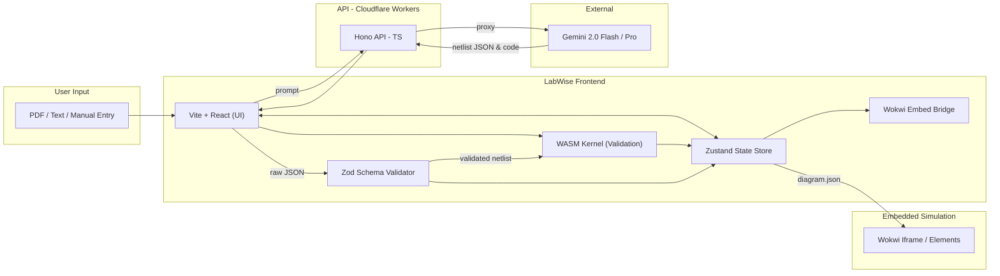

# LabWise — Master Implementation Plan

> **Philosophy:** *LabWise is the AI-powered Pre-Lab Environment.* AI extracts intent from messy lab manuals and constructs the circuit, while the Wokwi engine serves as the ultimate execution, embedded hardware emulation, and visualization environment.

---

## Architecture Overview



**Data Flow:**

1. User pastes text from their lab manual.
2. Frontend sends text to Hono API (Cloudflare Workers), which proxies to Gemini.
3. Gemini extracts a structural Netlist JSON and optional microcontroller code (C++/MicroPython).
4. **Zod validates** the raw JSON structure (correct fields, types, enums).
5. **Rust Governance** performs physics validation (short circuits, over-voltage, pin conflicts).
6. Frontend `Wokwi Bridge` maps the validated Netlist into Wokwi's `diagram.json` format.
7. The Wokwi simulator is embedded and initialized with the diagram and code.
8. The student visualizes and interacts with the exact circuit they need to build in the lab.

---

## Tech Stack

| Layer | Technology | Purpose |
| --- | --- | --- |
| **Frontend** | Vite + React + TypeScript | Application shell, AI chat interaction |
| **State** | Zustand | Global state (circuit, code, UI) |
| **Schema Validation** | Zod | Validate AI output structure (like Pydantic for TS) |
| **Simulation** | Wokwi Embed/Elements | 2D breadboard visualization, microcontroller emulation (Arduino, ESP32, Sensors) |
| **Validation** | Rust (`wasm-pack`) | Pre-simulation physics checks and structural governance |
| **API** | Hono on Cloudflare Workers | Gemini API proxy, protect secrets |
| **AI** | Gemini 2.0 Flash / Pro | Circuit & code extraction from lab manual text |
| **Deploy** | Cloudflare Pages + Workers | Edge hosting |

---

## Directory Structure

```text
LabWise/
├── kernel/                     # Rust validation engine
│   └── src/
│       ├── lib.rs              # Entry point
│       ├── governance.rs       # Sanity checks (shorts, conflicts)
│       ├── component_library.rs
│       ├── mna.rs              # MNA solver (fallback/quick-check)
│       └── netlist.rs          # Netlist schema and parsing
├── bridge/                     # WASM interface crate
│   └── src/lib.rs              # wasm-bindgen exports
├── projection/                 # Frontend (Vite + React + TS)
│   └── src/
│       ├── App.tsx
│       ├── App.css
│       ├── types.ts            # Core TS interfaces
│       ├── store/              # Zustand state management
│       │   ├── circuitStore.ts
│       │   ├── uiStore.ts
│       │   └── index.ts
│       ├── wokwi/              # Wokwi Integration Layer
│       │   ├── Mapper.ts       # Converts LabWise JSON → Wokwi diagram.json
│       │   └── WokwiEmbed.tsx  # React component wrapping the iframe
│       └── synapse/            # AI extraction orchestration
│           ├── promptBuilder.ts
│           ├── extractionPipeline.ts
│           └── schemas.ts      # Zod schemas for AI output validation
├── api/                        # Hono backend (Cloudflare Workers)
│   ├── src/index.ts            # Hono app with /api/gemini proxy
│   ├── wrangler.jsonc          # Wrangler config
│   └── .dev.vars               # Local secrets (gitignored)
├── schemas/                    # Shared JSON schemas
└── scripts/                    # Build scripts (WASM, CI)
```

---

## Priority Tiers

| Tier | Name | Definition |
| --- | --- | --- |
| **P0** | Demo or Die | The absolute minimum for a working demo. |
| **P1** | The Real Product | Features that make the tool practically useful for students. |
| **P2** | Polish and Scale | Nice-to-haves (saving, sharing, offline mode). |

---

## Phase 1 & 2: Infrastructure & Structural Governance ✅

> _Building the foundation. Cargo Workspace, React scaffold, Rust WASM Kernel that can parse, validate, and solve basic passive circuits._

| Step | Task | Status | Details |
| --- | --- | --- | --- |
| **1.1** | Setup Env | ✅ | Cargo workspace, WASM bridge, Vite React TS, build scripts. |
| **1.2** | Physical Governance | ✅ | Netlist JSON Schema, Rust `GovernanceManager` (shorts, conflicts, over-voltage). 26 tests pass. |
| **1.3** | Zustand State Stores | ✅ | `circuitStore` (netlist, solution, failures) + `uiStore` (selection, panels). Sample circuits. |
| **2.1** | MNA Solver | ✅ | LU Decomposition solver. Voltage divider + series-parallel verified within 0.01%. 38 tests pass. |

---

## Phase 3: Labwise.Synapse — The AI Bridge

> _The core differentiator. Using Gemini to transform unstructured lab text into structured circuits and code._

| Step | Task | Tier | Status | Details | Deliverable |
| --- | --- | --- | --- | --- | --- |
| **3.1.1** | Hono API Proxy | **P0** | ✅ | Hono on CF Workers. `POST /api/gemini` proxies to Gemini 2.0 Flash. CORS, error handling, health check. API key in `.dev.vars`. | `api/src/index.ts` |
| **3.1.2** | Prompt Bible | **P0** | ❌ | Strict system prompt: reads lab text → outputs JSON with (1) LabWise Netlist, (2) Arduino/C++ code, (3) Wokwi component types. | `synapse/promptBuilder.ts` |
| **3.1.3** | Zod Schema Validation | **P0** | ❌ | Define Zod schemas mirroring our `types.ts`. Validate raw Gemini JSON before it enters the store. Clear error messages on schema mismatch. | `synapse/schemas.ts` |
| **3.1.4** | Extraction Pipeline | **P0** | ❌ | React UI: paste text → call API → Zod validate → Rust governance check → populate Zustand store. Full end-to-end extraction flow. | `synapse/extractionPipeline.ts` |
| **3.1.5** | Refinement Loop | **P1** | ❌ | If Zod or Rust rejects the output, auto-prompt Gemini with errors to self-correct (max 2 retries). | Auto-correction logic |

---

## Phase 4: Wokwi Integration — Emulation & Visualization

> _Integrating the Wokwi simulation engine to visualize circuits and run embedded code._

| Step | Task | Tier | Status | Details | Deliverable |
| --- | --- | --- | --- | --- | --- |
| **4.1.1** | Wokwi Mapping Logic | **P0** | ❌ | TS mapper: LabWise `Netlist` → Wokwi `diagram.json` schema (`"type": "wokwi-arduino-uno"`, etc.). | `wokwi/Mapper.ts` |
| **4.1.2** | Embed Wokwi Simulator | **P0** | ❌ | `WokwiEmbed.tsx` component. Takes `diagram.json` + Arduino code, launches Wokwi via embed API. | `WokwiEmbed.tsx` |
| **4.1.3** | Bi-directional Sync | **P1** | ❌ | Read state from Wokwi (running?, serial output?) and display in LabWise UI. | UI indicators |

---

## Phase 5: Polish, QA, and Deployment

| Step | Task | Tier | Status | Details | Deliverable |
| --- | --- | --- | --- | --- | --- |
| **5.1.1** | Circuit Review Editor | **P1** | ❌ | Side panel showing extracted components. Students can manually correct AI mistakes before simulation. | `CircuitEditor.tsx` |
| **5.1.2** | Deployment | **P0** | ❌ | React app on CF Pages, API on CF Workers. CORS updated to production URL. | Live web app |
| **5.1.3** | PDF Upload | **P1** | ❌ | pdf.js client-side text extraction. Upload PDF → extract text → feed into prompt pipeline. | PDF upload UI |

---

## Golden Path Build Order

```
 1. ✅ Infrastructure & Rust Kernel              (Phase 1 & 2 done)
 2. ✅ Zustand State Stores                       (circuitStore + uiStore)
 3. ✅ CF Worker AI Proxy                         (Step 3.1.1)
 4. ❌ Prompt Bible                               (Step 3.1.2)
 5. ❌ Zod Schema Validation                      (Step 3.1.3)
 6. ❌ Extraction Pipeline + UI wiring            (Step 3.1.4)
      ↓ IM-1: "AI Extracts to Validated JSON"
 7. ❌ Wokwi JSON Mapper                          (Step 4.1.1)
 8. ❌ Wokwi Embed Component                      (Step 4.1.2)
      ↓ IM-2: "End-to-End Simulation" (MVP Complete)
 9. ❌ Editor / Refinement Loops                  (P1 Polish)
10. ❌ Deployment                                 (Phase 5)
```

---

## CORS Configuration Note

The API proxy currently allows `localhost:5173` (Vite dev) and `localhost:4173` (Vite preview).
When deploying to production, update the CORS origin in `api/src/index.ts` to include the
Cloudflare Pages URL (e.g., `https://labwise.pages.dev`). This is tracked in Step 5.1.2.
